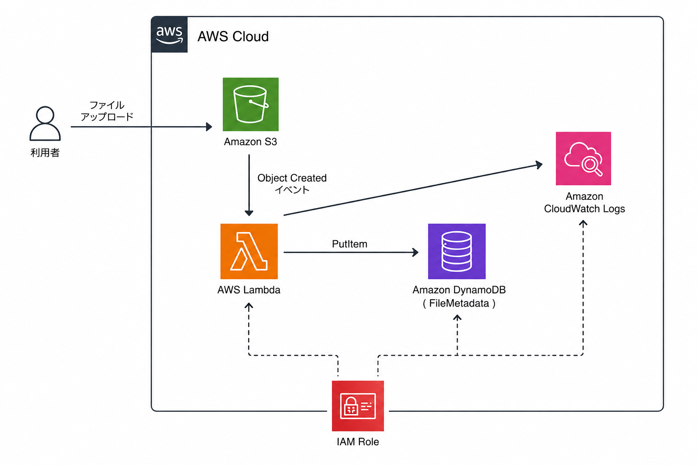

# AWS Event-Driven Serverless Architecture Hands-on
## AWS認定資格

- AWS Certified Solutions Architect - Associate（取得済）
- AWS Certified Solutions Architect - Professional（学習中）

## 概要

AWS Certified Solutions Architect - Associate（SAA）の学習アウトプットとして、AWSのマネージドサービスを利用したイベント駆動型サーバレスアーキテクチャを構築しました。

S3へのファイルアップロードをトリガーとしてLambdaを実行し、ファイル情報をDynamoDBへ登録する仕組みを実装しています。

本構成を通じて、イベント駆動設計やAWSサービス間連携について学習することを目的としています。

---

## 学習目的

- イベント駆動アーキテクチャの理解
- AWSマネージドサービス間の連携
- サーバレス設計の理解
- IAMによる権限制御
- CloudWatchを利用した監視・ログ管理
- DynamoDBの基本設計

---

## システム構成図



---

## アーキテクチャ

```text
利用者
   │
   ▼
Amazon S3
(ファイルアップロード)
   │
   │ Object Created
   ▼
AWS Lambda
(イベント処理)
   │
   ▼
Amazon DynamoDB
(メタデータ管理)
   │
   ▼
CloudWatch Logs
(ログ出力)

IAM
(権限制御)
```

---

## 処理フロー

### ① ファイルアップロード

利用者がAmazon S3へファイルをアップロードします。

### ② イベント通知

S3へファイルがアップロードされると、Object Createdイベントが生成されます。

### ③ Lambda実行

Lambda関数が自動的に起動し、アップロードされたファイル情報を取得します。

### ④ DynamoDB登録

取得したファイル情報をDynamoDBへ登録します。

### ⑤ ログ出力

処理結果をCloudWatch Logsへ出力します。

---

## 使用サービス

| サービス | 用途 |
|----------|------|
| Amazon S3 | ファイル保管 |
| AWS Lambda | イベント処理 |
| Amazon DynamoDB | メタデータ管理 |
| Amazon CloudWatch Logs | ログ監視 |
| AWS IAM | 権限制御 |

---

## DynamoDBテーブル設計

### テーブル名

```text
FileMetadata
```

### パーティションキー

```text
FileName
```

### 登録データ例

| 項目 | 内容 |
|--------|--------|
| FileName | sample.pdf |
| BucketName | event-driven-bucket |
| UploadTime | 2026-06-15T10:00:00 |
|
---

## Lambda実装内容

Lambdaでは以下の処理を実施します。

- S3イベントの受信
- ファイル名の取得
- バケット名の取得
- DynamoDBへの登録
- CloudWatch Logsへの出力

### 登録データ例

```json
{
  "FileName": "sample.pdf",
  "BucketName": "event-driven-bucket",
  "UploadTime": "2026-06-15T10:00:00",
 
}
```

---

## 工夫した点

### イベント駆動アーキテクチャ

S3イベントをトリガーとしてLambdaを起動することで、サーバを常時稼働させることなく処理を実現しています。

### マネージドサービス中心の設計

AWSのフルマネージドサービスを利用することで、インフラ管理の負担を軽減しています。

### 権限管理

Lambda実行ロールには必要最小限の権限を付与することを意識し、セキュリティを考慮した設計を行いました。

---

## 学習を通じて得られたこと

- AWSサービス間連携の理解
- イベント駆動アーキテクチャの理解
- サーバレス設計の考え方
- IAMによるアクセス制御
- CloudWatchを利用したログ監視
- DynamoDBの基本的な利用方法

---

## 今後の改善案

- Amazon SNSによる通知機能追加
- Amazon SQSによる疎結合化
- TerraformによるIaC化
- AWS Step Functionsによるワークフロー化
- メタデータ検索機能の追加
- 大規模なものであればRDSに変更も検討

---

## 作成背景

AWS Certified Solutions Architect - Associate（SAA）の学習を進める中で、イベント駆動アーキテクチャおよびサーバレスサービスへの理解を深めることを目的として作成しました。

また、できる限りコストを抑えながらAWSの主要なマネージドサービスを活用し、設計・構築・運用の流れを学習することを意識しています。
